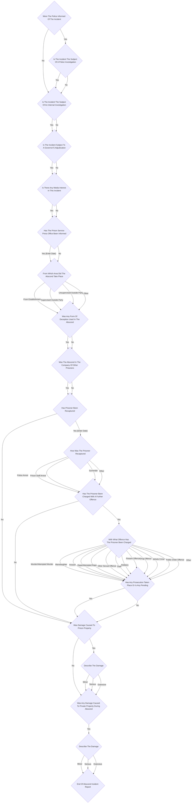

```mermaid
flowchart TB
    abscond1{"Were The Police Informed Of The Incident"} --> |"Yes"| abscond2
    abscond1{"Were The Police Informed Of The Incident"} --> |"No"| abscond3
    abscond2{"Is The Incident The Subject Of A Police Investigation"} --> |"Yes"| abscond3
    abscond2{"Is The Incident The Subject Of A Police Investigation"} --> |"No"| abscond3
    abscond3{"Is The Incident The Subject Of An Internal Investigation"} --> |"Yes"| abscond4
    abscond3{"Is The Incident The Subject Of An Internal Investigation"} --> |"No"| abscond4
    abscond4{"Is The Incident Subject To A Governor'S Adjudication"} --> |"Yes"| abscond5
    abscond4{"Is The Incident Subject To A Governor'S Adjudication"} --> |"No"| abscond5
    abscond5{"Is There Any Media Interest In This Incident"} --> |"Yes"| abscond6
    abscond5{"Is There Any Media Interest In This Incident"} --> |"No"| abscond6
    abscond6{"Has The Prison Service Press Office Been Informed"} --> |"Yes (Enter Date)"| abscond7
    abscond6{"Has The Prison Service Press Office Been Informed"} --> |"No"| abscond7
    abscond7{"From Which Area Did The Abscond Take Place"} --> |"From Establishment"| abscond8
    abscond7{"From Which Area Did The Abscond Take Place"} --> |"Supervised Outside Party"| abscond8
    abscond7{"From Which Area Did The Abscond Take Place"} --> |"Unsupervised Outside Party"| abscond8
    abscond7{"From Which Area Did The Abscond Take Place"} --> |"Other"| abscond8
    abscond8{"Was Any Form Of Deception Used In The Abscond"} --> |"Yes"| abscond9
    abscond8{"Was Any Form Of Deception Used In The Abscond"} --> |"No"| abscond9
    abscond9{"Was The Abscond In The Company Of Other Prisoners"} --> |"Yes"| abscond10
    abscond9{"Was The Abscond In The Company Of Other Prisoners"} --> |"No"| abscond10
    abscond10{"Has Prisoner Been Recaptured"} --> |"Yes (Enter Date)"| abscond11
    abscond10{"Has Prisoner Been Recaptured"} --> |"No"| abscond15
    abscond11{"How Was The Prisoner Recaptured"} --> |"Police Arrest"| abscond12
    abscond11{"How Was The Prisoner Recaptured"} --> |"Prison Staff Arrest"| abscond12
    abscond11{"How Was The Prisoner Recaptured"} --> |"Surrender"| abscond12
    abscond11{"How Was The Prisoner Recaptured"} --> |"Other"| abscond12
    abscond12{"Has The Prisoner Been Charged With A Further Offence"} --> |"Yes"| abscond13
    abscond12{"Has The Prisoner Been Charged With A Further Offence"} --> |"No"| abscond15
    abscond13{"With What Offence Has The Prisoner Been Charged"} --> |"Murder/Attempted Murder"| abscond14
    abscond13{"With What Offence Has The Prisoner Been Charged"} --> |"Manslaughter"| abscond14
    abscond13{"With What Offence Has The Prisoner Been Charged"} --> |"Assault"| abscond14
    abscond13{"With What Offence Has The Prisoner Been Charged"} --> |"Rape/Attempted Rape"| abscond14
    abscond13{"With What Offence Has The Prisoner Been Charged"} --> |"Other Sexual Offence"| abscond14
    abscond13{"With What Offence Has The Prisoner Been Charged"} --> |"Theft"| abscond14
    abscond13{"With What Offence Has The Prisoner Been Charged"} --> |"Robbery"| abscond14
    abscond13{"With What Offence Has The Prisoner Been Charged"} --> |"Firearm Offence"| abscond14
    abscond13{"With What Offence Has The Prisoner Been Charged"} --> |"Drug Offence"| abscond14
    abscond13{"With What Offence Has The Prisoner Been Charged"} --> |"Vehicle Crime"| abscond14
    abscond13{"With What Offence Has The Prisoner Been Charged"} --> |"Public Order Offence"| abscond14
    abscond13{"With What Offence Has The Prisoner Been Charged"} --> |"Other"| abscond14
    abscond14{"Has Any Prosecution Taken Place Or Is Any Pending"} --> |"Yes"| abscond15
    abscond14{"Has Any Prosecution Taken Place Or Is Any Pending"} --> |"No"| abscond15
    abscond15{"Was Damage Caused To Prison Property"} --> |"Yes"| abscond16
    abscond15{"Was Damage Caused To Prison Property"} --> |"No"| abscond17
    abscond16{"Describe The Damage"} --> |"Minor"| abscond17
    abscond16{"Describe The Damage"} --> |"Serious"| abscond17
    abscond16{"Describe The Damage"} --> |"Extensive"| abscond17
    abscond17{"Was Any Damage Caused To Private Property During Abscond"} --> |"Yes"| abscond18
    abscond18{"Describe The Damage"} --> |"Minor"| abscond19
    abscond18{"Describe The Damage"} --> |"Serious"| abscond19
    abscond18{"Describe The Damage"} --> |"Extensive"| abscond19
    abscond19{"End Of Abscond Incident Report"} 
```