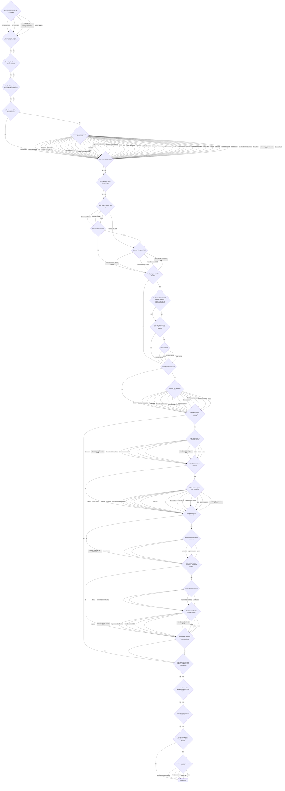

```mermaid
flowchart TD
    assaults31{"What Was The Main Management Outcome Of The Incident"} --> |"No Further Action"| assaults32
    assaults31{"What Was The Main Management Outcome Of The Incident"} --> |"Iep Regression"| assaults32
    assaults31{"What Was The Main Management Outcome Of The Incident"} --> |"Placed On Report/Adjudication Referral"| assaults32
    assaults31{"What Was The Main Management Outcome Of The Incident"} --> |"Police Referral"| assaults32
    assaults32{"Is Any Member Of Staff Facing Disciplinary Charges"} --> |"Yes"| assaults33
    assaults32{"Is Any Member Of Staff Facing Disciplinary Charges"} --> |"No"| assaults33
    assaults33{"Is There Any Media Interest In This Incident"} --> |"Yes"| assaults34
    assaults33{"Is There Any Media Interest In This Incident"} --> |"No"| assaults34
    assaults34{"Has The Prison Service Press Office Been Informed"} --> |"Yes"| assaults35
    assaults34{"Has The Prison Service Press Office Been Informed"} --> |"No"| assaults35
    assaults35{"Is The Location Of The Incdent Known"} --> |"Yes"| assaults36
    assaults35{"Is The Location Of The Incdent Known"} --> |"No"| assaults37
    assaults36{"What Was The Location Of The Incident"} --> |"Administration"| assaults37
    assaults36{"What Was The Location Of The Incident"} --> |"Association Area"| assaults37
    assaults36{"What Was The Location Of The Incident"} --> |"Cell"| assaults37
    assaults36{"What Was The Location Of The Incident"} --> |"Chapel"| assaults37
    assaults36{"What Was The Location Of The Incident"} --> |"Dining Room"| assaults37
    assaults36{"What Was The Location Of The Incident"} --> |"Dormitory"| assaults37
    assaults36{"What Was The Location Of The Incident"} --> |"Education"| assaults37
    assaults36{"What Was The Location Of The Incident"} --> |"Exercise Yard"| assaults37
    assaults36{"What Was The Location Of The Incident"} --> |"Gate"| assaults37
    assaults36{"What Was The Location Of The Incident"} --> |"Gym"| assaults37
    assaults36{"What Was The Location Of The Incident"} --> |"Health Care Centre"| assaults37
    assaults36{"What Was The Location Of The Incident"} --> |"Kitchen"| assaults37
    assaults36{"What Was The Location Of The Incident"} --> |"Office"| assaults37
    assaults36{"What Was The Location Of The Incident"} --> |"Reception"| assaults37
    assaults36{"What Was The Location Of The Incident"} --> |"Recess"| assaults37
    assaults36{"What Was The Location Of The Incident"} --> |"Segregation Unit"| assaults37
    assaults36{"What Was The Location Of The Incident"} --> |"Special Unit"| assaults37
    assaults36{"What Was The Location Of The Incident"} --> |"Showers/Changing Room"| assaults37
    assaults36{"What Was The Location Of The Incident"} --> |"Visits"| assaults37
    assaults36{"What Was The Location Of The Incident"} --> |"Wing"| assaults37
    assaults36{"What Was The Location Of The Incident"} --> |"Works Department"| assaults37
    assaults36{"What Was The Location Of The Incident"} --> |"Workshop"| assaults37
    assaults36{"What Was The Location Of The Incident"} --> |"Within Perimeter"| assaults37
    assaults36{"What Was The Location Of The Incident"} --> |"Elsewhere"| assaults37
    assaults36{"What Was The Location Of The Incident"} --> |"Funeral"| assaults37
    assaults36{"What Was The Location Of The Incident"} --> |"Hospital Outside (Patient)"| assaults37
    assaults36{"What Was The Location Of The Incident"} --> |"Hospital Outside (Visiting)"| assaults37
    assaults36{"What Was The Location Of The Incident"} --> |"Outside Working Party"| assaults37
    assaults36{"What Was The Location Of The Incident"} --> |"Sports Field"| assaults37
    assaults36{"What Was The Location Of The Incident"} --> |"Vehicle"| assaults37
    assaults36{"What Was The Location Of The Incident"} --> |"Weddings"| assaults37
    assaults36{"What Was The Location Of The Incident"} --> |"Magistrates Court"| assaults37
    assaults36{"What Was The Location Of The Incident"} --> |"Crown Court"| assaults37
    assaults36{"What Was The Location Of The Incident"} --> |"Induction/First Night Centre"| assaults37
    assaults36{"What Was The Location Of The Incident"} --> |"Mail Room"| assaults37
    assaults36{"What Was The Location Of The Incident"} --> |"Vulnerable Prisoners Unit (Vpu)"| assaults37
    assaults36{"What Was The Location Of The Incident"} --> |"External Roof"| assaults37
    assaults37{"Was This A Sexual Assault"} --> |"Yes"| assaults38
    assaults37{"Was This A Sexual Assault"} --> |"No"| assaults38
    assaults38{"Did The Assault Occur During A Fight"} --> |"Yes"| assaults39
    assaults38{"Did The Assault Occur During A Fight"} --> |"No"| assaults39
    assaults39{"What Type Of Assault Was It"} --> |"Prisoner On Prisoner"| assaults310
    assaults39{"What Type Of Assault Was It"} --> |"Prisoner On Staff"| assaults311
    assaults39{"What Type Of Assault Was It"} --> |"Prisoner On Other"| assaults310
    assaults39{"What Type Of Assault Was It"} --> |"Other"| assaults310
    assaults310{"Were Any Staff Assaulted"} --> |"No"| assaults312
    assaults310{"Were Any Staff Assaulted"} --> |"Yes"| assaults311
    assaults311{"Describe The Type Of Staff"} --> |"Operational Staff - Prison Officer"| assaults312
    assaults311{"Describe The Type Of Staff"} --> |"Operational Staff - Other"| assaults312
    assaults311{"Describe The Type Of Staff"} --> |"Non-Operational Staff"| assaults312
    assaults311{"Describe The Type Of Staff"} --> |"Non-Directly Employed Staff"| assaults312
    assaults312{"Was Spitting Used In This Incident"} --> |"No"| assaults316
    assaults312{"Was Spitting Used In This Incident"} --> |"Yes"| assaults313
    assaults313{"Is The Assailant Known To Have An Infectious Disease That Can Be Transmitted In Saliva"} --> |"No"| assaults314
    assaults313{"Is The Assailant Known To Have An Infectious Disease That Can Be Transmitted In Saliva"} --> |"Yes"| assaults314
    assaults314{"Did The Saliva Hit The Body Or Clothing Of The Victim(S)"} --> |"No"| assaults316
    assaults314{"Did The Saliva Hit The Body Or Clothing Of The Victim(S)"} --> |"Yes"| assaults315
    assaults315{"Where Did It Hit"} --> |"Neck Or Above"| assaults316
    assaults315{"Where Did It Hit"} --> |"Torso"| assaults316
    assaults315{"Where Did It Hit"} --> |"Arms Or Hands"| assaults316
    assaults315{"Where Did It Hit"} --> |"Legs Or Feet"| assaults316
    assaults316{"Were Any Weapons Used"} --> |"Yes"| assaults317
    assaults316{"Were Any Weapons Used"} --> |"No"| assaults318
    assaults317{"Describe The Weapons Used"} --> |"Firearm"| assaults318
    assaults317{"Describe The Weapons Used"} --> |"Chemical Incapacitant"| assaults318
    assaults317{"Describe The Weapons Used"} --> |"Knife/Blade"| assaults318
    assaults317{"Describe The Weapons Used"} --> |"Other Sharp Instrument"| assaults318
    assaults317{"Describe The Weapons Used"} --> |"Blunt Instrument"| assaults318
    assaults317{"Describe The Weapons Used"} --> |"Ligature"| assaults318
    assaults317{"Describe The Weapons Used"} --> |"Dangerous Liquid"| assaults318
    assaults317{"Describe The Weapons Used"} --> |"Excreta/Urine"| assaults318
    assaults317{"Describe The Weapons Used"} --> |"Food"| assaults318
    assaults317{"Describe The Weapons Used"} --> |"Thrown Furniture"| assaults318
    assaults317{"Describe The Weapons Used"} --> |"Thrown Equipment"| assaults318
    assaults317{"Describe The Weapons Used"} --> |"Other"| assaults318
    assaults318{"Were Any Injuries Received During This Incident"} --> |"Yes"| assaults319
    assaults318{"Were Any Injuries Received During This Incident"} --> |"No"| assaults328
    assaults319{"Enter Description Of Person(S) Injured"} --> |"Prisoners"| assaults320
    assaults319{"Enter Description Of Person(S) Injured"} --> |"Operational Staff - Prison Officer"| assaults320
    assaults319{"Enter Description Of Person(S) Injured"} --> |"Operational Staff - Other"| assaults320
    assaults319{"Enter Description Of Person(S) Injured"} --> |"Non-Operational Staff"| assaults320
    assaults319{"Enter Description Of Person(S) Injured"} --> |"Non-Directly Employed Staff"| assaults320
    assaults319{"Enter Description Of Person(S) Injured"} --> |"Police"| assaults320
    assaults319{"Enter Description Of Person(S) Injured"} --> |"Visitor"| assaults320
    assaults319{"Enter Description Of Person(S) Injured"} --> |"Other"| assaults320
    assaults320{"Was A Serious Injury Sustained"} --> |"Yes"| assaults321
    assaults320{"Was A Serious Injury Sustained"} --> |"No"| assaults322
    assaults321{"Which Serious Injuries Were Sustained"} --> |"Fracture"| assaults322
    assaults321{"Which Serious Injuries Were Sustained"} --> |"Scald Or Burn"| assaults322
    assaults321{"Which Serious Injuries Were Sustained"} --> |"Stabbing"| assaults322
    assaults321{"Which Serious Injuries Were Sustained"} --> |"Crushing"| assaults322
    assaults321{"Which Serious Injuries Were Sustained"} --> |"Extensive/Multiple Bruising"| assaults322
    assaults321{"Which Serious Injuries Were Sustained"} --> |"Black Eye"| assaults322
    assaults321{"Which Serious Injuries Were Sustained"} --> |"Broken Nose"| assaults322
    assaults321{"Which Serious Injuries Were Sustained"} --> |"Broken Teeth"| assaults322
    assaults321{"Which Serious Injuries Were Sustained"} --> |"Cuts Requiring Sutures"| assaults322
    assaults321{"Which Serious Injuries Were Sustained"} --> |"Bites"| assaults322
    assaults321{"Which Serious Injuries Were Sustained"} --> |"Gun Shot Wound"| assaults322
    assaults321{"Which Serious Injuries Were Sustained"} --> |"Temporary/Permanent Blindness"| assaults322
    assaults322{"Was A Minor Injury Sustained"} --> |"Yes"| assaults323
    assaults322{"Was A Minor Injury Sustained"} --> |"No"| assaults324
    assaults323{"Which Minor Injuries Were Sustained"} --> |"Grazes, Scratches Or Abrasions"| assaults324
    assaults323{"Which Minor Injuries Were Sustained"} --> |"Minor Bruises"| assaults324
    assaults323{"Which Minor Injuries Were Sustained"} --> |"Swellings"| assaults324
    assaults323{"Which Minor Injuries Were Sustained"} --> |"Superficial Cuts"| assaults324
    assaults323{"Which Minor Injuries Were Sustained"} --> |"Other"| assaults324
    assaults324{"Did Injuries Result In Attendance To Outside Hospital"} --> |"No"| assaults327
    assaults324{"Did Injuries Result In Attendance To Outside Hospital"} --> |"Yes"| assaults325
    assaults325{"Type Of Hospital Admission"} --> |"A And E"| assaults326
    assaults325{"Type Of Hospital Admission"} --> |"Inpatient (Overnight Only)"| assaults326
    assaults325{"Type Of Hospital Admission"} --> |"Inpatient (Over 24Hr)"| assaults326
    assaults325{"Type Of Hospital Admission"} --> |"Life Support"| assaults326
    assaults326{"Who Was Admitted To Outside Hospital"} --> |"Prisoners"| assaults327
    assaults326{"Who Was Admitted To Outside Hospital"} --> |"Operational Staff - Prison Officer"| assaults327
    assaults326{"Who Was Admitted To Outside Hospital"} --> |"Operational Staff - Other"| assaults327
    assaults326{"Who Was Admitted To Outside Hospital"} --> |"Non-Operational Staff"| assaults327
    assaults326{"Who Was Admitted To Outside Hospital"} --> |"Non-Directly Employed Staff"| assaults327
    assaults326{"Who Was Admitted To Outside Hospital"} --> |"Police"| assaults327
    assaults326{"Who Was Admitted To Outside Hospital"} --> |"Visitor"| assaults327
    assaults326{"Who Was Admitted To Outside Hospital"} --> |"Other"| assaults327
    assaults327{"Was Medical Treatment For Concussion Or Internal Injuries Required"} --> |"Yes"| assaults328
    assaults327{"Was Medical Treatment For Concussion Or Internal Injuries Required"} --> |"No"| assaults328
    assaults328{"Are There Any Staff Now Off Duty As A Result Of This Incident"} --> |"Yes"| assaults329
    assaults328{"Are There Any Staff Now Off Duty As A Result Of This Incident"} --> |"No"| assaults329
    assaults329{"Are Any Staff On Sick Leave As A Result Of This Incident"} --> |"Yes"| assaults330
    assaults329{"Are Any Staff On Sick Leave As A Result Of This Incident"} --> |"No"| assaults330
    assaults330{"Did The Assault Occur In Public View"} --> |"Yes"| assaults331
    assaults330{"Did The Assault Occur In Public View"} --> |"No"| assaults331
    assaults331{"Is There Any Audio Or Visual Footage Of The Assault"} --> |"No"| assaults333
    assaults331{"Is There Any Audio Or Visual Footage Of The Assault"} --> |"Yes"| assaults332
    assaults332{"What Is The Source Of The Footage"} --> |"Body Worn Video Camera"| assaults333
    assaults332{"What Is The Source Of The Footage"} --> |"Cctv"| assaults333
    assaults332{"What Is The Source Of The Footage"} --> |"Pin Phones"| assaults333
    assaults332{"What Is The Source Of The Footage"} --> |"Radio Net"| assaults333
    assaults332{"What Is The Source Of The Footage"} --> |"Other"| assaults333
```