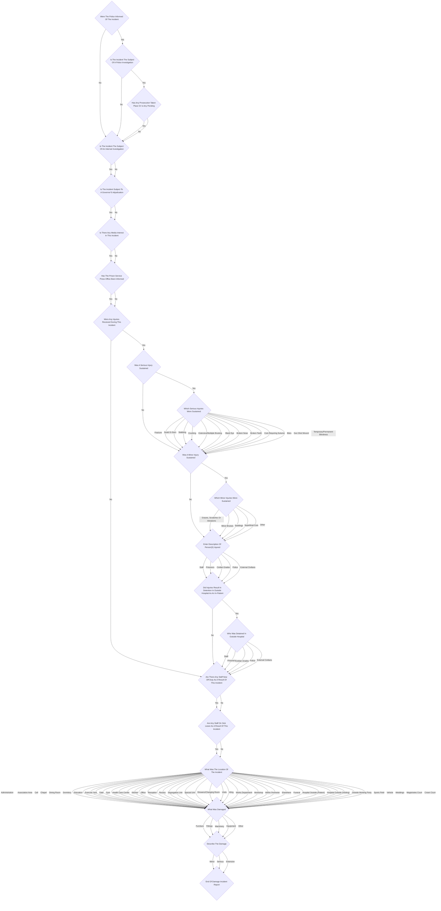

```mermaid
flowchart TD
    damage1{"Were The Police Informed Of The Incident"} --> |"Yes"| damage2
    damage1{"Were The Police Informed Of The Incident"} --> |"No"| damage4
    damage2{"Is The Incident The Subject Of A Police Investigation"} --> |"Yes"| damage3
    damage2{"Is The Incident The Subject Of A Police Investigation"} --> |"No"| damage4
    damage3{"Has Any Prosecution Taken Place Or Is Any Pending"} --> |"Yes"| damage4
    damage3{"Has Any Prosecution Taken Place Or Is Any Pending"} --> |"No"| damage4
    damage4{"Is The Incident The Subject Of An Internal Investigation"} --> |"Yes"| damage5
    damage4{"Is The Incident The Subject Of An Internal Investigation"} --> |"No"| damage5
    damage5{"Is The Incident Subject To A Governor'S Adjudication"} --> |"Yes"| damage6
    damage5{"Is The Incident Subject To A Governor'S Adjudication"} --> |"No"| damage6
    damage6{"Is There Any Media Interest In This Incident"} --> |"Yes"| damage7
    damage6{"Is There Any Media Interest In This Incident"} --> |"No"| damage7
    damage7{"Has The Prison Service Press Office Been Informed"} --> |"Yes"| damage8
    damage7{"Has The Prison Service Press Office Been Informed"} --> |"No"| damage8
    damage8{"Were Any Injuries Received During This Incident"} --> |"Yes"| damage9
    damage8{"Were Any Injuries Received During This Incident"} --> |"No"| damage16
    damage9{"Was A Serious Injury Sustained"} --> |"Yes"| damage10
    damage9{"Was A Serious Injury Sustained"} --> |"No"| damage11
    damage10{"Which Serious Injuries Were Sustained"} --> |"Fracture"| damage11
    damage10{"Which Serious Injuries Were Sustained"} --> |"Scald Or Burn"| damage11
    damage10{"Which Serious Injuries Were Sustained"} --> |"Stabbing"| damage11
    damage10{"Which Serious Injuries Were Sustained"} --> |"Crushing"| damage11
    damage10{"Which Serious Injuries Were Sustained"} --> |"Extensive/Multiple Bruising"| damage11
    damage10{"Which Serious Injuries Were Sustained"} --> |"Black Eye"| damage11
    damage10{"Which Serious Injuries Were Sustained"} --> |"Broken Nose"| damage11
    damage10{"Which Serious Injuries Were Sustained"} --> |"Broken Teeth"| damage11
    damage10{"Which Serious Injuries Were Sustained"} --> |"Cuts Requiring Sutures"| damage11
    damage10{"Which Serious Injuries Were Sustained"} --> |"Bites"| damage11
    damage10{"Which Serious Injuries Were Sustained"} --> |"Gun Shot Wound"| damage11
    damage10{"Which Serious Injuries Were Sustained"} --> |"Temporary/Permanent Blindness"| damage11
    damage11{"Was A Minor Injury Sustained"} --> |"Yes"| damage12
    damage11{"Was A Minor Injury Sustained"} --> |"No"| damage13
    damage12{"Which Minor Injuries Were Sustained"} --> |"Grazes, Scratches Or Abrasions"| damage13
    damage12{"Which Minor Injuries Were Sustained"} --> |"Minor Bruises"| damage13
    damage12{"Which Minor Injuries Were Sustained"} --> |"Swellings"| damage13
    damage12{"Which Minor Injuries Were Sustained"} --> |"Superficial Cuts"| damage13
    damage12{"Which Minor Injuries Were Sustained"} --> |"Other"| damage13
    damage13{"Enter Description Of Person(S) Injured"} --> |"Staff"| damage14
    damage13{"Enter Description Of Person(S) Injured"} --> |"Prisoners"| damage14
    damage13{"Enter Description Of Person(S) Injured"} --> |"Civilian Grades"| damage14
    damage13{"Enter Description Of Person(S) Injured"} --> |"Police"| damage14
    damage13{"Enter Description Of Person(S) Injured"} --> |"External Civilians"| damage14
    damage14{"Did Injuries Result In Detention In Outside Hospital As An In-Patient"} --> |"Yes"| damage15
    damage14{"Did Injuries Result In Detention In Outside Hospital As An In-Patient"} --> |"No"| damage16
    damage15{"Who Was Detained In Outside Hospital"} --> |"Staff"| damage16
    damage15{"Who Was Detained In Outside Hospital"} --> |"Prisoners"| damage16
    damage15{"Who Was Detained In Outside Hospital"} --> |"Civilian Grades"| damage16
    damage15{"Who Was Detained In Outside Hospital"} --> |"Police"| damage16
    damage15{"Who Was Detained In Outside Hospital"} --> |"External Civilians"| damage16
    damage16{"Are There Any Staff Now Off Duty As A Result Of This Incident"} --> |"Yes"| damage17
    damage16{"Are There Any Staff Now Off Duty As A Result Of This Incident"} --> |"No"| damage17
    damage17{"Are Any Staff On Sick Leave As A Result Of This Incident"} --> |"Yes"| damage18
    damage17{"Are Any Staff On Sick Leave As A Result Of This Incident"} --> |"No"| damage18
    damage18{"What Was The Location Of The Incident"} --> |"Administration"| damage19
    damage18{"What Was The Location Of The Incident"} --> |"Association Area"| damage19
    damage18{"What Was The Location Of The Incident"} --> |"Cell"| damage19
    damage18{"What Was The Location Of The Incident"} --> |"Chapel"| damage19
    damage18{"What Was The Location Of The Incident"} --> |"Dining Room"| damage19
    damage18{"What Was The Location Of The Incident"} --> |"Dormitory"| damage19
    damage18{"What Was The Location Of The Incident"} --> |"Education"| damage19
    damage18{"What Was The Location Of The Incident"} --> |"Exercise Yard"| damage19
    damage18{"What Was The Location Of The Incident"} --> |"Gate"| damage19
    damage18{"What Was The Location Of The Incident"} --> |"Gym"| damage19
    damage18{"What Was The Location Of The Incident"} --> |"Health Care Centre"| damage19
    damage18{"What Was The Location Of The Incident"} --> |"Kitchen"| damage19
    damage18{"What Was The Location Of The Incident"} --> |"Office"| damage19
    damage18{"What Was The Location Of The Incident"} --> |"Reception"| damage19
    damage18{"What Was The Location Of The Incident"} --> |"Recess"| damage19
    damage18{"What Was The Location Of The Incident"} --> |"Segregation Unit"| damage19
    damage18{"What Was The Location Of The Incident"} --> |"Special Unit"| damage19
    damage18{"What Was The Location Of The Incident"} --> |"Showers/Changing Room"| damage19
    damage18{"What Was The Location Of The Incident"} --> |"Visits"| damage19
    damage18{"What Was The Location Of The Incident"} --> |"Wing"| damage19
    damage18{"What Was The Location Of The Incident"} --> |"Works Department"| damage19
    damage18{"What Was The Location Of The Incident"} --> |"Workshop"| damage19
    damage18{"What Was The Location Of The Incident"} --> |"Within Perimeter"| damage19
    damage18{"What Was The Location Of The Incident"} --> |"Elsewhere"| damage19
    damage18{"What Was The Location Of The Incident"} --> |"Funeral"| damage19
    damage18{"What Was The Location Of The Incident"} --> |"Hospital Outside (Patient)"| damage19
    damage18{"What Was The Location Of The Incident"} --> |"Hospital Outside (Visiting)"| damage19
    damage18{"What Was The Location Of The Incident"} --> |"Outside Working Party"| damage19
    damage18{"What Was The Location Of The Incident"} --> |"Sports Field"| damage19
    damage18{"What Was The Location Of The Incident"} --> |"Vehicle"| damage19
    damage18{"What Was The Location Of The Incident"} --> |"Weddings"| damage19
    damage18{"What Was The Location Of The Incident"} --> |"Magistrates Court"| damage19
    damage18{"What Was The Location Of The Incident"} --> |"Crown Court"| damage19
    damage19{"What Was Damaged"} --> |"Furniture"| damage20
    damage19{"What Was Damaged"} --> |"Fittings"| damage20
    damage19{"What Was Damaged"} --> |"Machinery"| damage20
    damage19{"What Was Damaged"} --> |"Equipment"| damage20
    damage19{"What Was Damaged"} --> |"Other"| damage20
    damage20{"Describe The Damage"} --> |"Minor"| damage21
    damage20{"Describe The Damage"} --> |"Serious"| damage21
    damage20{"Describe The Damage"} --> |"Extensive"| damage21
    damage21{"End Of Damage Incident Report"}
```