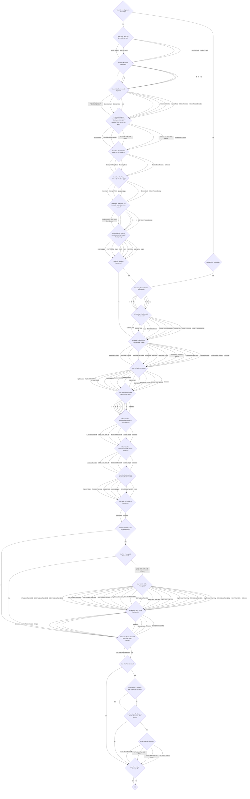

```mermaid
flowchart TD
    drone11{"Was A Drone Sighted In Mid-Flight?"} --> |"Yes"| drone12
    drone11{"Was A Drone Sighted In Mid-Flight?"} --> |"No"| drone111
    drone12{"What Time Was The Drone(S) Sighted?"} --> |"12Am To 6Am"| drone13
    drone12{"What Time Was The Drone(S) Sighted?"} --> |"6Am To 12Pm"| drone13
    drone12{"What Time Was The Drone(S) Sighted?"} --> |"12Pm To 6Pm"| drone13
    drone12{"What Time Was The Drone(S) Sighted?"} --> |"6Pm To 12Am"| drone13
    drone13{"Number Of Drones Observed?"} --> |"1"| drone14
    drone13{"Number Of Drones Observed?"} --> |"2"| drone14
    drone13{"Number Of Drones Observed?"} --> |"3"| drone14
    drone13{"Number Of Drones Observed?"} --> |"4"| drone14
    drone13{"Number Of Drones Observed?"} --> |"5"| drone14
    drone13{"Number Of Drones Observed?"} --> |"6+"| drone14
    drone14{"Where Was The Drone(S) Sighted?"} --> |"Beyond The External Perimeter Border"| drone15
    drone14{"Where Was The Drone(S) Sighted?"} --> |"Exercise Yard"| drone15
    drone14{"Where Was The Drone(S) Sighted?"} --> |"External Roof"| drone15
    drone14{"Where Was The Drone(S) Sighted?"} --> |"Gate"| drone15
    drone14{"Where Was The Drone(S) Sighted?"} --> |"Near Cell Window"| drone15
    drone14{"Where Was The Drone(S) Sighted?"} --> |"Sports Field"| drone15
    drone14{"Where Was The Drone(S) Sighted?"} --> |"Within Perimeter"| drone15
    drone14{"Where Was The Drone(S) Sighted?"} --> |"Other (Please Specify)"| drone15
    drone15{"For Drone(S) Sighted Beyond Perimeter Border, How Close Did The Nearest Drone Get To The Wall?"} --> |"Not Applicable"| drone16
    drone15{"For Drone(S) Sighted Beyond Perimeter Border, How Close Did The Nearest Drone Get To The Wall?"} --> |"0 To Less Than 10 Metres"| drone16
    drone15{"For Drone(S) Sighted Beyond Perimeter Border, How Close Did The Nearest Drone Get To The Wall?"} --> |"10 To Less Than 100 Metres"| drone16
    drone15{"For Drone(S) Sighted Beyond Perimeter Border, How Close Did The Nearest Drone Get To The Wall?"} --> |"100 To Less Than 200 Metres"| drone16
    drone15{"For Drone(S) Sighted Beyond Perimeter Border, How Close Did The Nearest Drone Get To The Wall?"} --> |"200 Metres Or More"| drone16
    drone16{"What Was The Estimated Speed Of The Drone(S)?"} --> |"Static"| drone17
    drone16{"What Was The Estimated Speed Of The Drone(S)?"} --> |"Walking Pace"| drone17
    drone16{"What Was The Estimated Speed Of The Drone(S)?"} --> |"Running Pace"| drone17
    drone16{"What Was The Estimated Speed Of The Drone(S)?"} --> |"Faster Than Running"| drone17
    drone16{"What Was The Estimated Speed Of The Drone(S)?"} --> |"Unknown"| drone17
    drone17{"What Was The Flying Pattern Of The Drone(S)?"} --> |"Hovering"| drone18
    drone17{"What Was The Flying Pattern Of The Drone(S)?"} --> |"Circling A Point"| drone18
    drone17{"What Was The Flying Pattern Of The Drone(S)?"} --> |"Straight Flight"| drone18
    drone17{"What Was The Flying Pattern Of The Drone(S)?"} --> |"Direct Attack"| drone18
    drone17{"What Was The Flying Pattern Of The Drone(S)?"} --> |"Other (Please Specify)"| drone18
    drone18{"How Many Times Has The Drone(S) Been Seen Here Before?"} --> |"Not Believed To Have Been Seen Before"| drone19
    drone18{"How Many Times Has The Drone(S) Been Seen Here Before?"} --> |"1"| drone19
    drone18{"How Many Times Has The Drone(S) Been Seen Here Before?"} --> |"2"| drone19
    drone18{"How Many Times Has The Drone(S) Been Seen Here Before?"} --> |"3"| drone19
    drone18{"How Many Times Has The Drone(S) Been Seen Here Before?"} --> |"5"| drone19
    drone18{"How Many Times Has The Drone(S) Been Seen Here Before?"} --> |"6 Or More (Please Specify)"| drone19
    drone19{"What Were The Weather Conditions At The Time Of The Sighting?"} --> |"Clear Visibility"| drone110
    drone19{"What Were The Weather Conditions At The Time Of The Sighting?"} --> |"Poor Visibility"| drone110
    drone19{"What Were The Weather Conditions At The Time Of The Sighting?"} --> |"Light"| drone110
    drone19{"What Were The Weather Conditions At The Time Of The Sighting?"} --> |"Dark"| drone110
    drone19{"What Were The Weather Conditions At The Time Of The Sighting?"} --> |"Rain"| drone110
    drone19{"What Were The Weather Conditions At The Time Of The Sighting?"} --> |"High Wind"| drone110
    drone19{"What Were The Weather Conditions At The Time Of The Sighting?"} --> |"Low Wind"| drone110
    drone19{"What Were The Weather Conditions At The Time Of The Sighting?"} --> |"Calm"| drone110
    drone110{"Was The Drone(S) Recovered?"} --> |"Yes"| drone112
    drone110{"Was The Drone(S) Recovered?"} --> |"No"| drone114
    drone111{"Was A Drone Recovered?"} --> |"Yes"| drone112
    drone112{"How Many Drone(S) Was Recovered?"} --> |"1"| drone113
    drone112{"How Many Drone(S) Was Recovered?"} --> |"2"| drone113
    drone112{"How Many Drone(S) Was Recovered?"} --> |"3"| drone113
    drone112{"How Many Drone(S) Was Recovered?"} --> |"4"| drone113
    drone112{"How Many Drone(S) Was Recovered?"} --> |"5"| drone113
    drone112{"How Many Drone(S) Was Recovered?"} --> |"6+"| drone113
    drone113{"Where Was The Drone(S) Recovered?"} --> |"Exercise Yard"| drone114
    drone113{"Where Was The Drone(S) Recovered?"} --> |"External Roof"| drone114
    drone113{"Where Was The Drone(S) Recovered?"} --> |"Gate"| drone114
    drone113{"Where Was The Drone(S) Recovered?"} --> |"Near Cell Window"| drone114
    drone113{"Where Was The Drone(S) Recovered?"} --> |"External Perimeter Border"| drone114
    drone113{"Where Was The Drone(S) Recovered?"} --> |"Sports Field"| drone114
    drone113{"Where Was The Drone(S) Recovered?"} --> |"Within Perimeter"| drone114
    drone113{"Where Was The Drone(S) Recovered?"} --> |"Other (Please Specify)"| drone114
    drone114{"What Was The Drone(S) Type/Airframe Shape?"} --> |"Multicopter: Square"| drone115
    drone114{"What Was The Drone(S) Type/Airframe Shape?"} --> |"Multicopter: Circular"| drone115
    drone114{"What Was The Drone(S) Type/Airframe Shape?"} --> |"Multicopter: X-Shape"| drone115
    drone114{"What Was The Drone(S) Type/Airframe Shape?"} --> |"Multicopter: Hourglass"| drone115
    drone114{"What Was The Drone(S) Type/Airframe Shape?"} --> |"Multicopter: Other"| drone115
    drone114{"What Was The Drone(S) Type/Airframe Shape?"} --> |"Fixed Wing: Standard Aircraft"| drone115
    drone114{"What Was The Drone(S) Type/Airframe Shape?"} --> |"Fixed Wing: Delta-Wing"| drone115
    drone114{"What Was The Drone(S) Type/Airframe Shape?"} --> |"Fixed Wing: Other"| drone115
    drone114{"What Was The Drone(S) Type/Airframe Shape?"} --> |"Other (Please Specify)"| drone115
    drone114{"What Was The Drone(S) Type/Airframe Shape?"} --> |"Unknown"| drone115
    drone115{"What Is The Drone Model?"} --> |"Dji Phantom"| drone116
    drone115{"What Is The Drone Model?"} --> |"Syma X8C Venture"| drone116
    drone115{"What Is The Drone Model?"} --> |"Diy Racing Uav"| drone116
    drone115{"What Is The Drone Model?"} --> |"T600 Inspire 1"| drone116
    drone115{"What Is The Drone Model?"} --> |"Century Neo660"| drone116
    drone115{"What Is The Drone Model?"} --> |"X-8 Flyingwing"| drone116
    drone115{"What Is The Drone Model?"} --> |"Talon X-Uav"| drone116
    drone115{"What Is The Drone Model?"} --> |"Sky Hunter"| drone116
    drone115{"What Is The Drone Model?"} --> |"Piper Model Aircraft"| drone116
    drone115{"What Is The Drone Model?"} --> |"Other (Please Specify)"| drone116
    drone115{"What Is The Drone Model?"} --> |"Unknown"| drone116
    drone116{"How Many Motors Does The Drone(S) Have?"} --> |"1"| drone117
    drone116{"How Many Motors Does The Drone(S) Have?"} --> |"2"| drone117
    drone116{"How Many Motors Does The Drone(S) Have?"} --> |"3"| drone117
    drone116{"How Many Motors Does The Drone(S) Have?"} --> |"4"| drone117
    drone116{"How Many Motors Does The Drone(S) Have?"} --> |"5"| drone117
    drone116{"How Many Motors Does The Drone(S) Have?"} --> |"6"| drone117
    drone116{"How Many Motors Does The Drone(S) Have?"} --> |"7"| drone117
    drone116{"How Many Motors Does The Drone(S) Have?"} --> |"8+"| drone117
    drone116{"How Many Motors Does The Drone(S) Have?"} --> |"Unknown"| drone117
    drone117{"What Was The Approximate Length Of The Drone(S)?"} --> |"0 To Less Than 1M"| drone118
    drone117{"What Was The Approximate Length Of The Drone(S)?"} --> |"1M To Less Than 2M"| drone118
    drone117{"What Was The Approximate Length Of The Drone(S)?"} --> |"2M To Less Than 3M"| drone118
    drone117{"What Was The Approximate Length Of The Drone(S)?"} --> |"3M Or Longer"| drone118
    drone117{"What Was The Approximate Length Of The Drone(S)?"} --> |"Unknown"| drone118
    drone118{"What Was The Approximate Width Of The Drone(S)?"} --> |"0 To Less Than 1M"| drone119
    drone118{"What Was The Approximate Width Of The Drone(S)?"} --> |"1M To Less Than 2M"| drone119
    drone118{"What Was The Approximate Width Of The Drone(S)?"} --> |"2M To Less Than 3M"| drone119
    drone118{"What Was The Approximate Width Of The Drone(S)?"} --> |"3M Or Longer"| drone119
    drone118{"What Was The Approximate Width Of The Drone(S)?"} --> |"Unknown"| drone119
    drone119{"What Modifications Were Made To The Drone(S)?"} --> |"Painted Black"| drone120
    drone119{"What Modifications Were Made To The Drone(S)?"} --> |"Removed Camera"| drone120
    drone119{"What Modifications Were Made To The Drone(S)?"} --> |"Added Hook"| drone120
    drone119{"What Modifications Were Made To The Drone(S)?"} --> |"Covered Lights"| drone120
    drone119{"What Modifications Were Made To The Drone(S)?"} --> |"Other (Please Specify)"| drone120
    drone119{"What Modifications Were Made To The Drone(S)?"} --> |"None"| drone120
    drone120{"How Was The Drone(S) Recovered?"} --> |"Intercepted"| drone121
    drone120{"How Was The Drone(S) Recovered?"} --> |"Crashed"| drone121
    drone121{"Did The Drone(S) Carry Any Package(S)?"} --> |"Yes"| drone122
    drone121{"Did The Drone(S) Carry Any Package(S)?"} --> |"No"| drone125
    drone122{"Was The Package(S) Recovered?"} --> |"Yes (Please Enter The Finds Report Incident Number)"| drone123
    drone122{"Was The Package(S) Recovered?"} --> |"No"| drone125
    drone123{"Total Weight Of The Package(S)?"} --> |"0 To Less Than 100G"| drone124
    drone123{"Total Weight Of The Package(S)?"} --> |"100G To Less Than 200G"| drone124
    drone123{"Total Weight Of The Package(S)?"} --> |"200G To Less Than 300G"| drone124
    drone123{"Total Weight Of The Package(S)?"} --> |"300G To Less Than 400G"| drone124
    drone123{"Total Weight Of The Package(S)?"} --> |"400G To Less Than 500G"| drone124
    drone123{"Total Weight Of The Package(S)?"} --> |"500G To Less Than 1Kg"| drone124
    drone123{"Total Weight Of The Package(S)?"} --> |"1Kg To Less Than 2Kg"| drone124
    drone123{"Total Weight Of The Package(S)?"} --> |"2Kg To Less Than 3Kg"| drone124
    drone123{"Total Weight Of The Package(S)?"} --> |"3Kg To Less Than 4Kg"| drone124
    drone123{"Total Weight Of The Package(S)?"} --> |"4Kg To Less Than 5Kg"| drone124
    drone123{"Total Weight Of The Package(S)?"} --> |"5Kg To Less Than 6Kg"| drone124
    drone123{"Total Weight Of The Package(S)?"} --> |"6Kg To Less Than 7Kg"| drone124
    drone123{"Total Weight Of The Package(S)?"} --> |"7Kg To Less Than 8Kg"| drone124
    drone123{"Total Weight Of The Package(S)?"} --> |"8Kg To Less Than 9Kg"| drone124
    drone123{"Total Weight Of The Package(S)?"} --> |"9Kg To Less Than 10Kg"| drone124
    drone123{"Total Weight Of The Package(S)?"} --> |"More Than 10Kg"| drone124
    drone123{"Total Weight Of The Package(S)?"} --> |"Unknown"| drone124
    drone124{"What Items Were In The Package(S)?"} --> |"Cameras"| drone125
    drone124{"What Items Were In The Package(S)?"} --> |"Mobile Phone Devices"| drone125
    drone124{"What Items Were In The Package(S)?"} --> |"Drugs"| drone125
    drone124{"What Items Were In The Package(S)?"} --> |"Weapons"| drone125
    drone124{"What Items Were In The Package(S)?"} --> |"Alcohol/Hooch"| drone125
    drone124{"What Items Were In The Package(S)?"} --> |"Tobacco"| drone125
    drone124{"What Items Were In The Package(S)?"} --> |"Other (Please Specify)"| drone125
    drone125{"Were Any Photos Taken Of The Drone And/Or Payload?"} --> |"Yes (Specify Where Sent)"| drone126
    drone125{"Were Any Photos Taken Of The Drone And/Or Payload?"} --> |"No"| drone126
    drone126{"Was The Pilot Identified?"} --> |"Yes"| drone127
    drone126{"Was The Pilot Identified?"} --> |"No"| drone130
    drone127{"Do You Know If The Pilot Was Using Line Of Sight?"} --> |"Yes"| drone128
    drone127{"Do You Know If The Pilot Was Using Line Of Sight?"} --> |"No"| drone128
    drone128{"Do You Know The Distance Of The Pilot From The Prison?"} --> |"Yes"| drone129
    drone128{"Do You Know The Distance Of The Pilot From The Prison?"} --> |"No"| drone130
    drone129{"What Was The Distance?"} --> |"0 To Less Than 10 Metres"| drone130
    drone129{"What Was The Distance?"} --> |"10 To Less Than 100 Metres"| drone130
    drone129{"What Was The Distance?"} --> |"100 To Less Than 200 Metres"| drone130
    drone129{"What Was The Distance?"} --> |"200 Metres Or More"| drone130
    drone130{"Were The Police Contacted?"} --> |"Yes"| drone131
    drone130{"Were The Police Contacted?"} --> |"No"| drone131
    drone131{"End"}
```