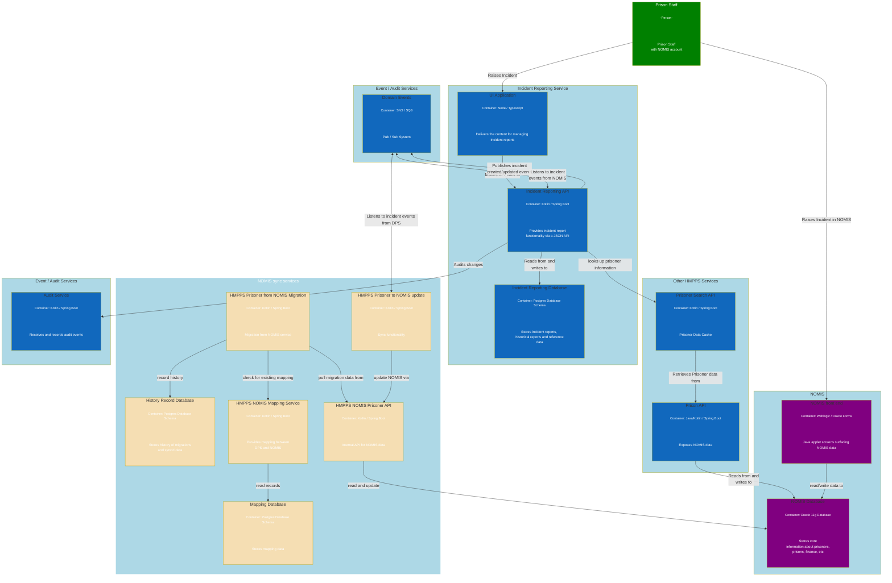

```mermaid
flowchart TB

subgraph prisonStaff[Prison Staff]
    h1[-Person-]:::type
    d1[Prison Staff \n with NOMIS account]:::description
end
prisonStaff:::person

prisonStaff--Raises Incident -->uiApplication
prisonStaff--Raises Incident in NOMIS -->oracleForms

subgraph incidentReportingService[Incident Reporting Service]
    subgraph uiApplication[UI Application]
        direction LR
        h2[Container: Node / Typescript]:::type
        d2[Delivers the content for managing incident reports]:::description
    end
    uiApplication:::internalContainer

    subgraph incidentReportingApi[Incident Reporting API]
        direction LR
        h5[Container: Kotlin / Spring Boot]:::type
        d5[Provides incident report \n functionality via a JSON API]:::description
    end
    incidentReportingApi:::internalContainer

    subgraph database[Incident Reporting Database]
        direction LR
        h6[Container: Postgres Database Schema]:::type
        d6[Stores incident reports, \n historical reports and reference data]:::description
    end
    database:::internalContainer

    uiApplication--Makes API calls to -->incidentReportingApi
    incidentReportingApi--Reads from and \n writes to -->database
end
incidentReportingService:::internalSystem

incidentReportingApi--Publishes incident \n created/updated events -->domainEvents
incidentReportingApi--Audits changes -->auditService

domainEvents<--Listens to incident \n events from NOMIS-->incidentReportingApi
    
subgraph otherServices[Other HMPPS Services]
    subgraph prisonApi[Prison API]
        direction LR
        h31[Container: Java/Kotlin / Spring Boot]:::type
        d31[Exposes NOMIS data]:::description
    end
    prisonApi:::internalContainer

    subgraph prisonerSearchApi[Prisoner Search API]
        direction LR
        h32[Container: Kotlin / Spring Boot]:::type
        d32[Prisoner Data Cache]:::description
    end
    prisonerSearchApi:::internalContainer
    
    prisonerSearchApi--Retrieves Prisoner data from  -->prisonApi

end
otherServices:::internalSystem

subgraph nomisSyncSystem[NOMIS sync services]
    subgraph nomisPrisonerApi[HMPPS NOMIS Prisoner API]
        direction LR
        h11[Container: Kotlin / Spring Boot]:::type
        d11[Internal API for NOMIS data]:::description
    end
    nomisPrisonerApi:::migrationContainer
    
    subgraph nomisUpdateApi[HMPPS Prisoner to NOMIS update]
        direction LR
        h16[Container: Kotlin / Spring Boot]:::type
        d16[Sync functionality]:::description
    end
    nomisUpdateApi:::migrationContainer

    subgraph nomisMigrationApi[HMPPS Prisoner from NOMIS Migration]
        direction LR
        h12[Container: Kotlin / Spring Boot]:::type
        d12[Migration from NOMIS service]:::description
    end
    nomisMigrationApi:::migrationContainer

    subgraph nomisMappingService[HMPPS NOMIS Mapping Service]
        direction LR
        h13[Container: Kotlin / Spring Boot]:::type
        d13[Provides mapping between \n DPS and NOMIS]:::description
    end
    nomisMappingService:::migrationContainer

    subgraph historyDb[History Record Database]
        direction LR
        h14[Container: Postgres Database Schema]:::type
        d14[Stores history of migrations \n and sync'd data]:::description
    end
    historyDb:::migrationContainer
    
    subgraph mappingDb[Mapping Database]
        direction LR
        h15[Container: Postgres Database Schema]:::type
        d15[Stores mapping data]:::description
    end
    mappingDb:::migrationContainer

    nomisMigrationApi-- pull migration data from -->nomisPrisonerApi
    nomisMigrationApi-- check for existing mapping -->nomisMappingService
    nomisMigrationApi-- record history -->historyDb
    nomisMappingService-- read records -->mappingDb
    nomisUpdateApi--update NOMIS via -->nomisPrisonerApi

    
end
nomisSyncSystem:::otherHmppsSystem

domainEvents<--Listens to incident events from DPS -->nomisUpdateApi

subgraph eventsSystem[Event / Audit Services]
    subgraph domainEvents[Domain Events]
        direction LR
        h61[Container: SNS / SQS]:::type
        d61[Pub / Sub System]:::description
    end
    domainEvents:::internalContainer
end
eventsSystem:::internalSystem

subgraph auditSystem[Event / Audit Services]
    subgraph auditService[Audit Service]
        direction LR
        h62[Container: Kotlin / Spring Boot]:::type
        d62[Receives and records audit events]:::description
    end
    auditService:::internalContainer
end
auditSystem:::internalSystem

prisonApi--Reads from and \n writes to -->nomisDb
nomisPrisonerApi--read and update -->nomisDb
incidentReportingApi--looks up prisoner information -->prisonerSearchApi

subgraph NOMIS[NOMIS]
    subgraph oracleForms[NOMIS front end]
        direction LR
        h91[Container: Weblogic / Oracle Forms]:::type
        d91[Java applet screens surfacing NOMIS data]:::description
    end
    oracleForms:::legacyContainer
    
    subgraph nomisDb[NOMIS Database]
        direction LR
        h92[Container: Oracle 11g Database]:::type
        d92[Stores core \n information about prisoners, \n prisons, finance, etc]:::description
    end
    nomisDb:::legacyContainer

    oracleForms-- read/write data to -->nomisDb
end
NOMIS:::legacySystem


%% Element type definitions

classDef person fill:green, color:#fff
classDef internalContainer fill:#1168bd
classDef migrationContainer fill:wheat
classDef legacyContainer fill:purple
classDef internalSystem fill:lightblue
classDef legacySystem fill:lightblue 
classDef otherHmppsSystem fill: lightblue, color:#fff, stroke-width:0px  

classDef type stroke-width:0px, color:#fff, fill:transparent, font-size:12px
classDef description stroke-width:0px, color:#fff, fill:transparent, font-size:13px
```