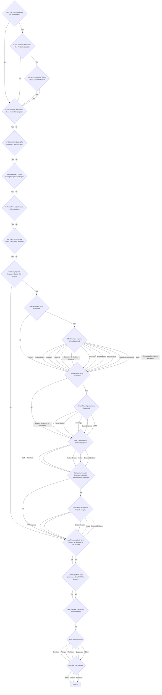

```mermaid
flowchart TD
    misc1{"Were The Police Informed Of The Incident"} --> |"Yes"| misc2
    misc1{"Were The Police Informed Of The Incident"} --> |"No"| misc4
    misc2{"Is The Incident The Subject Of A Police Investigation"} --> |"Yes"| misc3
    misc2{"Is The Incident The Subject Of A Police Investigation"} --> |"No"| misc4
    misc3{"Has Any Prosecution Taken Place Or Is Any Pending"} --> |"Yes"| misc4
    misc3{"Has Any Prosecution Taken Place Or Is Any Pending"} --> |"No"| misc4
    misc4{"Is The Incident The Subject Of An Internal Investigation"} --> |"Yes"| misc5
    misc4{"Is The Incident The Subject Of An Internal Investigation"} --> |"No"| misc5
    misc5{"Is The Incident Subject To A Governor'S Adjudication"} --> |"Yes"| misc6
    misc5{"Is The Incident Subject To A Governor'S Adjudication"} --> |"No"| misc6
    misc6{"Is Any Member Of Staff Facing Disciplinary Charges"} --> |"Yes"| misc7
    misc6{"Is Any Member Of Staff Facing Disciplinary Charges"} --> |"No"| misc7
    misc7{"Is There Any Media Interest In This Incident"} --> |"Yes"| misc8
    misc7{"Is There Any Media Interest In This Incident"} --> |"No"| misc8
    misc8{"Has The Prison Service Press Office Been Informed"} --> |"Yes"| misc9
    misc8{"Has The Prison Service Press Office Been Informed"} --> |"No"| misc9
    misc9{"Were Any Injuries Received During This Incident"} --> |"Yes"| misc10
    misc9{"Were Any Injuries Received During This Incident"} --> |"No"| misc17
    misc10{"Was A Serious Injury Sustained"} --> |"Yes"| misc11
    misc10{"Was A Serious Injury Sustained"} --> |"No"| misc12
    misc11{"Which Serious Injuries Were Sustained"} --> |"Fracture"| misc12
    misc11{"Which Serious Injuries Were Sustained"} --> |"Scald Or Burn"| misc12
    misc11{"Which Serious Injuries Were Sustained"} --> |"Stabbing"| misc12
    misc11{"Which Serious Injuries Were Sustained"} --> |"Crushing"| misc12
    misc11{"Which Serious Injuries Were Sustained"} --> |"Extensive Or Multiple Bruising"| misc12
    misc11{"Which Serious Injuries Were Sustained"} --> |"Black Eye"| misc12
    misc11{"Which Serious Injuries Were Sustained"} --> |"Broken Nose"| misc12
    misc11{"Which Serious Injuries Were Sustained"} --> |"Broken Teeth"| misc12
    misc11{"Which Serious Injuries Were Sustained"} --> |"Cuts Requiring Suturing"| misc12
    misc11{"Which Serious Injuries Were Sustained"} --> |"Bites"| misc12
    misc11{"Which Serious Injuries Were Sustained"} --> |"Temporary/Permanent Blindness"| misc12
    misc12{"Was A Minor Injury Sustained"} --> |"Yes"| misc13
    misc12{"Was A Minor Injury Sustained"} --> |"No"| misc14
    misc13{"Which Minor Injuries Were Sustained"} --> |"Grazes, Scratches Or Abrasions"| misc14
    misc13{"Which Minor Injuries Were Sustained"} --> |"Minor Bruises"| misc14
    misc13{"Which Minor Injuries Were Sustained"} --> |"Swellings"| misc14
    misc13{"Which Minor Injuries Were Sustained"} --> |"Superficial Cuts"| misc14
    misc13{"Which Minor Injuries Were Sustained"} --> |"Other"| misc14
    misc14{"Enter Description Of Person(S) Injured"} --> |"Staff"| misc15
    misc14{"Enter Description Of Person(S) Injured"} --> |"Prisoners"| misc15
    misc14{"Enter Description Of Person(S) Injured"} --> |"Civilian Grades"| misc15
    misc14{"Enter Description Of Person(S) Injured"} --> |"Police"| misc15
    misc14{"Enter Description Of Person(S) Injured"} --> |"External Civilians"| misc15
    misc15{"Did Injuries Result In Detention In Outside Hospital As An In-Patient"} --> |"Yes"| misc16
    misc15{"Did Injuries Result In Detention In Outside Hospital As An In-Patient"} --> |"No"| misc17
    misc16{"Who Was Detained In Outside Hospital"} --> |"Staff"| misc17
    misc16{"Who Was Detained In Outside Hospital"} --> |"Prisoners"| misc17
    misc16{"Who Was Detained In Outside Hospital"} --> |"Civilian Grades"| misc17
    misc16{"Who Was Detained In Outside Hospital"} --> |"Police"| misc17
    misc16{"Who Was Detained In Outside Hospital"} --> |"External Civilians"| misc17
    misc17{"Are There Any Staff Now Off Duty As A Result Of This Incident"} --> |"Yes"| misc18
    misc17{"Are There Any Staff Now Off Duty As A Result Of This Incident"} --> |"No"| misc18
    misc18{"Are Any Staff On Sick Leave As A Result Of This Incident"} --> |"Yes"| misc19
    misc18{"Are Any Staff On Sick Leave As A Result Of This Incident"} --> |"No"| misc19
    misc19{"Was Damage Caused To Prison Property"} --> |"Yes"| misc20
    misc20{"What Was Damaged"} --> |"Furniture"| misc21
    misc20{"What Was Damaged"} --> |"Fittings"| misc21
    misc20{"What Was Damaged"} --> |"Machinery"| misc21
    misc20{"What Was Damaged"} --> |"Equipment"| misc21
    misc20{"What Was Damaged"} --> |"Other"| misc21
    misc21{"Describe The Damage"} --> |"Minor"| misc22
    misc21{"Describe The Damage"} --> |"Serious"| misc22
    misc21{"Describe The Damage"} --> |"Extensive"| misc22
```