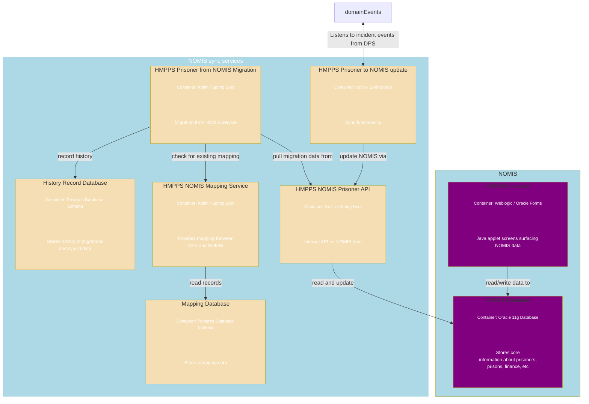

```mermaid
flowchart TB
    subgraph nomisSyncSystem[NOMIS sync services]
        subgraph nomisPrisonerApi[HMPPS NOMIS Prisoner API]
            direction LR
            h11[Container: Kotlin / Spring Boot]:::type
            d11[Internal API for NOMIS data]:::description
        end
        nomisPrisonerApi:::migrationContainer

        subgraph nomisUpdateApi[HMPPS Prisoner to NOMIS update]
            direction LR
            h16[Container: Kotlin / Spring Boot]:::type
            d16[Sync functionality]:::description
        end
        nomisUpdateApi:::migrationContainer

        subgraph nomisMigrationApi[HMPPS Prisoner from NOMIS Migration]
            direction LR
            h12[Container: Kotlin / Spring Boot]:::type
            d12[Migration from NOMIS service]:::description
        end
        nomisMigrationApi:::migrationContainer

        subgraph nomisMappingService[HMPPS NOMIS Mapping Service]
            direction LR
            h13[Container: Kotlin / Spring Boot]:::type
            d13[Provides mapping between \n DPS and NOMIS]:::description
        end
        nomisMappingService:::migrationContainer

        subgraph historyDb[History Record Database]
            direction LR
            h14[Container: Postgres Database Schema]:::type
            d14[Stores history of migrations \n and sync'd data]:::description
        end
        historyDb:::migrationContainer

        subgraph mappingDb[Mapping Database]
            direction LR
            h15[Container: Postgres Database Schema]:::type
            d15[Stores mapping data]:::description
        end
        mappingDb:::migrationContainer

        nomisMigrationApi-- pull migration data from -->nomisPrisonerApi
        nomisMigrationApi-- check for existing mapping -->nomisMappingService
        nomisMigrationApi-- record history -->historyDb
        nomisMappingService-- read records -->mappingDb
        nomisUpdateApi--update NOMIS via -->nomisPrisonerApi


    end
    nomisSyncSystem:::otherHmppsSystem

    subgraph NOMIS[NOMIS]
        subgraph oracleForms[NOMIS front end]
            direction LR
            h91[Container: Weblogic / Oracle Forms]:::type
            d91[Java applet screens surfacing NOMIS data]:::description
        end
        oracleForms:::legacyContainer

        subgraph nomisDb[NOMIS Database]
            direction LR
            h92[Container: Oracle 11g Database]:::type
            d92[Stores core \n information about prisoners, \n prisons, finance, etc]:::description
        end
        nomisDb:::legacyContainer

        oracleForms-- read/write data to -->nomisDb
    end
    NOMIS:::legacySystem

    domainEvents<--Listens to incident events from DPS -->nomisUpdateApi
    nomisPrisonerApi--read and update -->nomisDb

    classDef migrationContainer fill:wheat
    classDef otherHmppsSystem fill: lightblue, color:#fff, stroke-width:0px  
    classDef legacyContainer fill:purple
    classDef internalSystem fill:lightblue
    classDef legacySystem fill:lightblue 

    classDef type stroke-width:0px, color:#fff, fill:transparent, font-size:12px
    classDef description stroke-width:0px, color:#fff, fill:transparent, font-size:13px
    
```