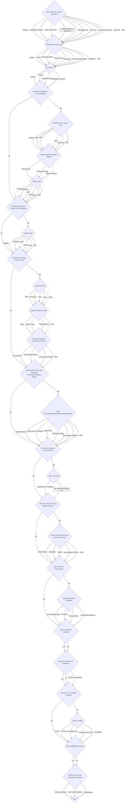

```mermaid
flowchart TD
    self_harm1{"Where Did The Incident Take Place"} -->|" Ordinary "| self_harm2
    self_harm1{"Where Did The Incident Take Place"} -->|" Vpu/Other Protected "| self_harm2
    self_harm1{"Where Did The Incident Take Place"} -->|" Health Care Centre "| self_harm2
    self_harm1{"Where Did The Incident Take Place"} -->|" Indct'N/Recp'N/1St Nightcentre "| self_harm2
    self_harm1{"Where Did The Incident Take Place"} -->|" Segregation Unit "| self_harm2
    self_harm1{"Where Did The Incident Take Place"} -->|" Detox Unit "| self_harm2
    self_harm1{"Where Did The Incident Take Place"} -->|" Prison Escort Vehicle "| self_harm2
    self_harm1{"Where Did The Incident Take Place"} -->|" Court Cell "| self_harm2
    self_harm1{"Where Did The Incident Take Place"} -->|" Other "| self_harm2
    self_harm2{"What Was The Cell Type"} -->|" Ordinary "| self_harm3
    self_harm2{"What Was The Cell Type"} -->|" Gated "| self_harm3
    self_harm2{"What Was The Cell Type"} -->|" Safe Anti-Ligature "| self_harm3
    self_harm2{"What Was The Cell Type"} -->|" Time Out Room "| self_harm3
    self_harm2{"What Was The Cell Type"} -->|" Care Suite "| self_harm3
    self_harm2{"What Was The Cell Type"} -->|" Unfurnished/Strong Box "| self_harm3
    self_harm2{"What Was The Cell Type"} -->|" Ward/Dorm "| self_harm3
    self_harm2{"What Was The Cell Type"} -->|" Other "| self_harm3
    self_harm3{"Occupancy"} -->|" Single "| self_harm4
    self_harm3{"Occupancy"} -->|" Double "| self_harm4
    self_harm3{"Occupancy"} -->|" Double But Alone "| self_harm4
    self_harm3{"Occupancy"} -->|" Multiple (3 Or More) "| self_harm4
    self_harm4{"Did Self Harm Method Involve Hanging"} -->|" Yes "| self_harm5
    self_harm4{"Did Self Harm Method Involve Hanging"} -->|" No "| self_harm8
    self_harm5{"What Was The Ligature Point"} -->|" Window "| self_harm6
    self_harm5{"What Was The Ligature Point"} -->|" Bed "| self_harm6
    self_harm5{"What Was The Ligature Point"} -->|" Door "| self_harm6
    self_harm5{"What Was The Ligature Point"} -->|" Pipes "| self_harm6
    self_harm5{"What Was The Ligature Point"} -->|" Toilet Area "| self_harm6
    self_harm5{"What Was The Ligature Point"} -->|" Other "| self_harm6
    self_harm6{"Hanging Self Strangulation Method"} -->|" Feet Off Floor "| self_harm7
    self_harm6{"Hanging Self Strangulation Method"} -->|" Kneeling Or Other "| self_harm7
    self_harm6{"Hanging Self Strangulation Method"} -->|" Neither Of Above "| self_harm7
    self_harm7{"Ligature Type"} -->|" Bedding "| self_harm8
    self_harm7{"Ligature Type"} -->|" Shoelaces "| self_harm8
    self_harm7{"Ligature Type"} -->|" Towel "| self_harm8
    self_harm7{"Ligature Type"} -->|" Clothing "| self_harm8
    self_harm7{"Ligature Type"} -->|" Belt "| self_harm8
    self_harm7{"Ligature Type"} -->|" Other "| self_harm8
    self_harm8{"Did Self Harm Method Involve Self Strangulation"} -->|" Yes "| self_harm9
    self_harm8{"Did Self Harm Method Involve Self Strangulation"} -->|" No "| self_harm10
    self_harm9{"Ligature Type"} -->|" Bedding "| self_harm10
    self_harm9{"Ligature Type"} -->|" Shoelaces "| self_harm10
    self_harm9{"Ligature Type"} -->|" Towel "| self_harm10
    self_harm9{"Ligature Type"} -->|" Clothing "| self_harm10
    self_harm9{"Ligature Type"} -->|" Belt "| self_harm10
    self_harm9{"Ligature Type"} -->|" Other "| self_harm10
    self_harm10{"Did Self Harm Method Involve Cutting"} -->|" Yes "| self_harm11
    self_harm10{"Did Self Harm Method Involve Cutting"} -->|" No "| self_harm14
    self_harm11{"Location Of Cuts"} -->|" Wrist "| self_harm12
    self_harm11{"Location Of Cuts"} -->|" Arms/Legs "| self_harm12
    self_harm11{"Location Of Cuts"} -->|" Torso "| self_harm12
    self_harm11{"Location Of Cuts"} -->|" Throat "| self_harm12
    self_harm11{"Location Of Cuts"} -->|" Other "| self_harm12
    self_harm12{"Type Of Implement Used"} -->|" Razor "| self_harm13
    self_harm12{"Type Of Implement Used"} -->|" Broken Glass "| self_harm13
    self_harm12{"Type Of Implement Used"} -->|" Plastic Material "| self_harm13
    self_harm12{"Type Of Implement Used"} -->|" Other "| self_harm13
    self_harm13{"Treatment Required Following Cut Scratch"} -->|" No Treatment "| self_harm14
    self_harm13{"Treatment Required Following Cut Scratch"} -->|" Steri Strips Or Sutures "| self_harm14
    self_harm13{"Treatment Required Following Cut Scratch"} -->|" Cleaned And Dressed "| self_harm14
    self_harm13{"Treatment Required Following Cut Scratch"} -->|" Other "| self_harm14
    self_harm14{"Did Self Harm Involve Self Poisoning/ Overdose/Swallowing Objects"} -->|" Yes "| self_harm15
    self_harm14{"Did Self Harm Involve Self Poisoning/ Overdose/Swallowing Objects"} -->|" No "| self_harm16
    self_harm15{"Self Poisoning/Overdose/Substances/Swallowing"} -->|" Own Medication "| self_harm16
    self_harm15{"Self Poisoning/Overdose/Substances/Swallowing"} -->|" Other Persons Medication "| self_harm16
    self_harm15{"Self Poisoning/Overdose/Substances/Swallowing"} -->|" Illegal Drugs "| self_harm16
    self_harm15{"Self Poisoning/Overdose/Substances/Swallowing"} -->|" Cleaning Materials "| self_harm16
    self_harm15{"Self Poisoning/Overdose/Substances/Swallowing"} -->|" Razor Blades "| self_harm16
    self_harm15{"Self Poisoning/Overdose/Substances/Swallowing"} -->|" Batteries "| self_harm16
    self_harm15{"Self Poisoning/Overdose/Substances/Swallowing"} -->|" Other "| self_harm16
    self_harm16{"Did Self Harm Method Involve Burning"} -->|" Yes "| self_harm17
    self_harm16{"Did Self Harm Method Involve Burning"} -->|" No "| self_harm18
    self_harm17{"Type Of Burning"} -->|" Superficial E.G. Cigarette "| self_harm18
    self_harm17{"Type Of Burning"} -->|" Non Superficial Cell/Self Fire "| self_harm18
    self_harm18{"Was Any Other Self Harm Method Involved"} -->|" Yes "| self_harm19
    self_harm18{"Was Any Other Self Harm Method Involved"} -->|" No "| self_harm20
    self_harm19{"What Other Method Of Self Harm Was Involved"} -->|" Head Banging "| self_harm20
    self_harm19{"What Other Method Of Self Harm Was Involved"} -->|" Suffocation "| self_harm20
    self_harm19{"What Other Method Of Self Harm Was Involved"} -->|" Wound "| self_harm20
    self_harm19{"What Other Method Of Self Harm Was Involved"} -->|" Noose Ligature Making "| self_harm20
    self_harm19{"What Other Method Of Self Harm Was Involved"} -->|" Other "| self_harm20
    self_harm20{"Was Treatment Administered"} -->|" Yes "| self_harm21
    self_harm20{"Was Treatment Administered"} -->|" No "| self_harm22
    self_harm21{"Who Administered Treatment"} -->|" Non Healthcare Staff "| self_harm22
    self_harm21{"Who Administered Treatment"} -->|" Nurse/Hco "| self_harm22
    self_harm21{"Who Administered Treatment"} -->|" Medical Officer "| self_harm22
    self_harm21{"Who Administered Treatment"} -->|" Paramedics/Ambulance "| self_harm22
    self_harm22{"Was Resuscitation Required"} -->|" Yes "| self_harm23
    self_harm22{"Was Resuscitation Required"} -->|" No "| self_harm23
    self_harm23{"Were They Admitted To Healthcare"} -->|" Yes "| self_harm24
    self_harm23{"Were They Admitted To Healthcare"} -->|" No "| self_harm24
    self_harm23{"Were They Admitted To Healthcare"} -->|" Already In Healthcare "| self_harm24
    self_harm24{"Did They Go To Outside Hospital"} -->|" Yes "| self_harm25
    self_harm24{"Did They Go To Outside Hospital"} -->|" No "| self_harm26
    self_harm25{"Type Of Hospital"} -->|" A And E "| self_harm26
    self_harm25{"Type Of Hospital"} -->|" In Patient (Overnight Only) "| self_harm26
    self_harm25{"Type Of Hospital"} -->|" In Patient (Over 24Hr) "| self_harm26
    self_harm25{"Type Of Hospital"} -->|" Life Support "| self_harm26
    self_harm26{"Was A F2052Sh/Acct Open"} -->|" Yes "| self_harm27
    self_harm26{"Was A F2052Sh/Acct Open"} -->|" No "| self_harm27
    self_harm27{"When Was The Last F2052Sh/Acct Closed"} -->|" Within One Month "| self_harm28
    self_harm27{"When Was The Last F2052Sh/Acct Closed"} -->|" More Than One Month "| self_harm28
    self_harm27{"When Was The Last F2052Sh/Acct Closed"} -->|" Not Applicable "| self_harm28
    self_harm28{"End"}
```